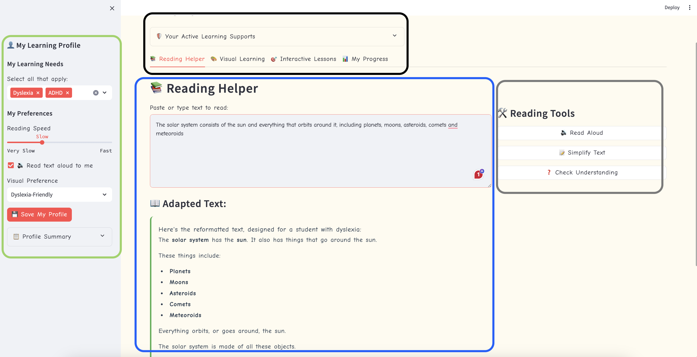
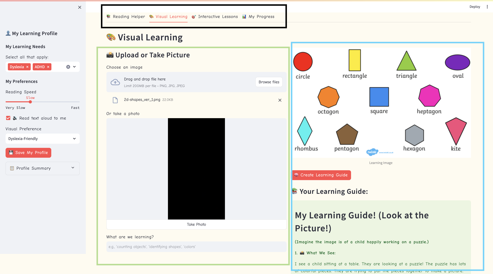
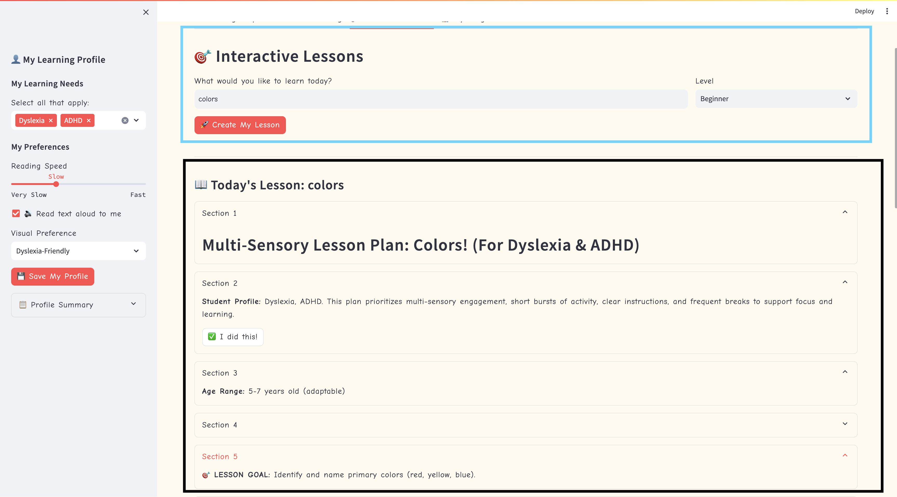
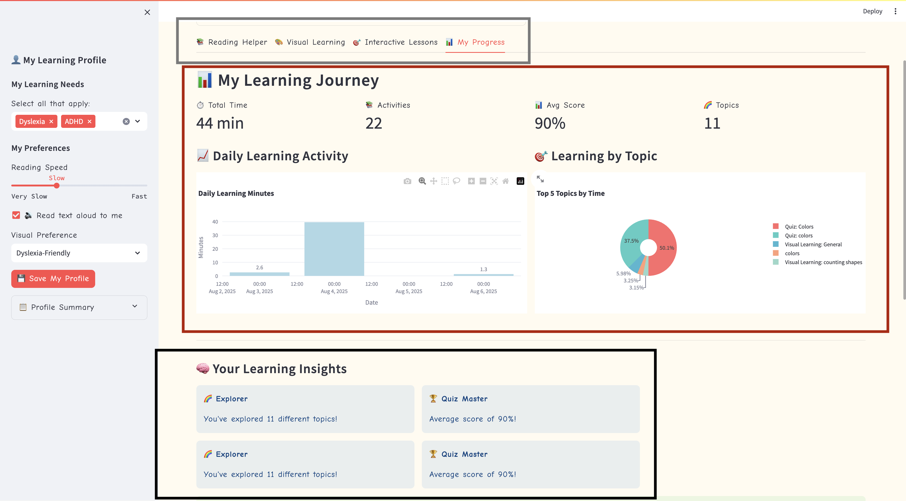

## 📚 **EmpowerEd – Core App Features**

EmpowerEd is an inclusive, offline-first AI learning companion designed for students with learning disabilities. It leverages a fine-tuned and quantized version of Google’s **Gemma-3n model** to deliver adaptive, multimodal educational support through text, vision, and speech.

---

### 🧩 **1. Reading Helper**

A powerful AI-driven tool that adapts reading material to individual learning needs.

* **Adaptive Text Formatting**: Increases line spacing and highlights keywords to enhance readability.
* **Text Simplification**: Automatically rewrites complex passages to match the user’s comprehension level.
* **Text-to-Speech (TTS)**: Converts text into natural-sounding audio for auditory learners and those with reading challenges.
* **Comprehension Support**: Generates interactive questions to reinforce understanding.
* **Ideal For**: Dyslexia, ADHD, visual processing issues, and general reading support.




---

### 🖼️ **2. Visual Learning**

Transforms images into guided educational experiences using vision-language modeling.

* **Image Upload and Analysis**: Accepts images (e.g., diagrams, photos) and generates structured learning content.
* **AI-Generated Learning Guides**: Identifies visual elements, explains key concepts, and connects them to real-world examples.
* **Multimodal Interaction**: Each guide includes both visual and auditory formats, enhancing engagement and retention.
* **Audio Narration**: Descriptions and guides can be played aloud, combining visual and auditory learning seamlessly.
* **Perfect For**: Visual learners, students with autism, or those who benefit from structured visuals.




---

### 🧠 **3. Interactive Lessons**

Gamified, bite-sized educational modules tailored to various cognitive and attention profiles.

* **Personalized Lesson Flow**: Users select topics and difficulty levels; lessons adapt in real-time based on engagement.
* **Chunked Content**: Information is broken into manageable parts, supporting focus and retention.
* **Built-In Breaks**: Designed with attention spans in mind, ensuring learning remains engaging, not overwhelming.
* **Instant Feedback & Rewards**: Encourages motivation and tracks understanding through real-time interaction.
* **Supports**: ADHD, executive functioning challenges, and general learning needs.




---

### 📊 **4. My Progress**

An intuitive analytics dashboard for learners, parents, and educators.

* **Real-Time Learning Insights**: Tracks time spent on activities and areas of improvement.
* **Visual Progress Charts**: Uses bar graphs and pie charts to display learning patterns and outcomes.
* **Personalized Recommendations**: Offers targeted suggestions based on learning history and model inferences.
* **Goal Setting**: Allows setting and tracking of personalized academic goals.
* **Powered By**: Gemma-3n’s language and reasoning capabilities, optimized for low-latency, on-device inference.




---

## 🤖 Powered by **Gemma-3n AI**

* **Multimodal AI Processing**:

  * **Text**: Adaptive formatting, simplification, comprehension support
  * **Vision**: Content generation from images, structured guides
  * **Audio**: Text-to-speech and speech recognition
* **Model Optimization**:

  * Fine-tuned and quantized version of Google’s **Gemma-3n** model
  * Reduced model size by \~50%
  * Faster, privacy-preserving on-device performance
  * Enhanced educational accuracy and personalization

---

## 🧩 Accessibility-First Design

* **Visual Modes**: Normal, High Contrast, Dark Mode, Dyslexia-Friendly
* **Multi-Sensory Learning**: Combines visual, auditory, and interactive inputs
* **Adaptive Interface**: UI adjusts based on individual disability profiles


