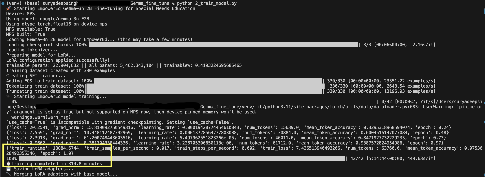
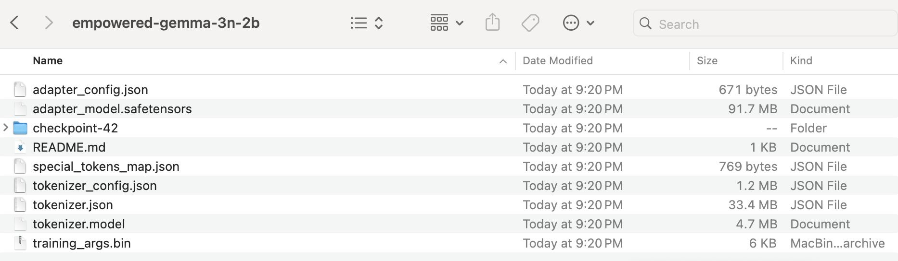
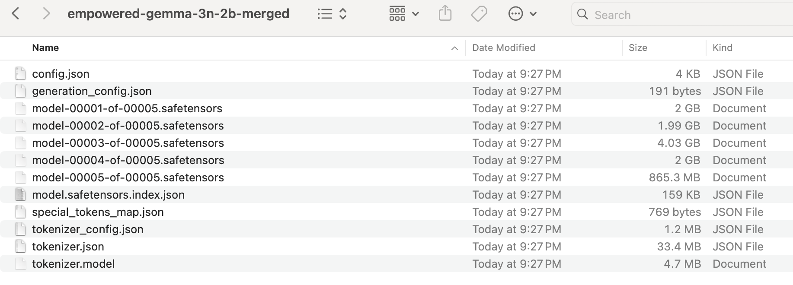

### EmpowerEd: Gemma-3n 2B Fine-tune for Special Needs Education

This repository contains the code and configuration for fine-tuning the **Gemma-3n 2B** model to create **EmpowerEd**, a specialized AI assistant for special needs education. EmpowerEd is designed to make learning more accessible and effective for students with a range of learning differences.

### 🎥 Demo Video
[**Watch the demo here →**](https://youtu.be/EW7DdGiynVE) See how Sarah, a 10-year-old with Dyslexia and ADHD, reads confidently for the first time using EmpowerEd.

### Features

  - **Text Simplification:** Transforms complex academic content into easy-to-read formats.
  - **Structured Lessons:** Generates step-by-step learning modules for predictable and clear instruction.
  - **Multi-sensory Content:** Incorporates visual, auditory, and kinesthetic elements into explanations.
  - **Executive Functioning Support:** Provides tools for organization, focus, and study management.
  - **Empathy and Accessibility:** The model is trained to be supportive and provide responses that are easy to understand.

### Fine-tuning Process

The project uses a custom dataset of educational prompts and specialized responses to fine-tune the Gemma-3n 2B model. We employ the **PEFT (Parameter-Efficient Fine-Tuning)** with **LoRA (Low-Rank Adaptation)** to efficiently train the model without requiring extensive computational resources. 

### Project Structure

```
.
├── finetune_Gemma_3n_LLM.py              # The main fine-tuning script
├── data
│   └── empowered_training_examples.json  # The curated training dataset
├── models
│   ├── empowered-gemma-3n-2b           # Output directory for LoRA adapters  (Check below: I have added the screen-shots of the model in the README.md file as the size of model is bigger than 100MB GitHub is not allowing my to upload file)
│   └── empowered-gemma-3n-2b-merged    # Output directory for the merged model (Check below: I have added the screen-shots of the model in the README.md file as the size of model is bigger than 100MB GitHub is not allowing my to upload file)
└── requirements.txt            # Python dependencies
```

### Installation

To run this project, you need to set up a Python environment and install the required libraries.

```bash
pip install -r requirements.txt
```

### Usage

**Run the Fine-tuning Script:**

   ```bash
   python finetune_Gemma_3n_LLM.py
   ```

   This script will:

 - Download and load the `google/gemma-3n-E2B` model and tokenizer.
 - Prepare the model for k-bit training and apply the LoRA configuration.
 - Load the training data from `data/empowered_training_examples.json`.
 - Start the fine-tuning process.
 - Save the trained LoRA adapters in `models/empowered-gemma-3n-2b`.
 - Merge the adapters with the base model and save the final, deployable model in `models/empowered-gemma-3n-2b-merged`.
 
 ---
 
 
 **Fine Tuning Steps**
 ---
 
 **LoRA Adapter**
 ---
 
 **Fine Tuned Model, merged with adapters**